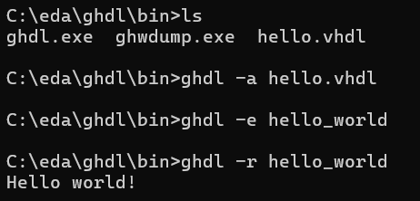
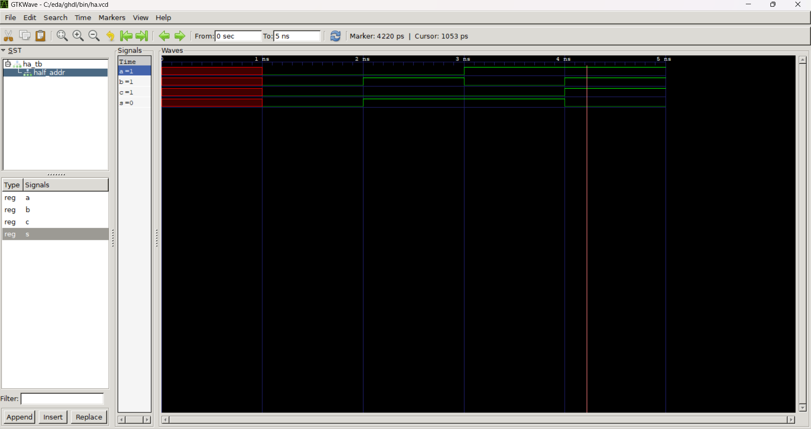
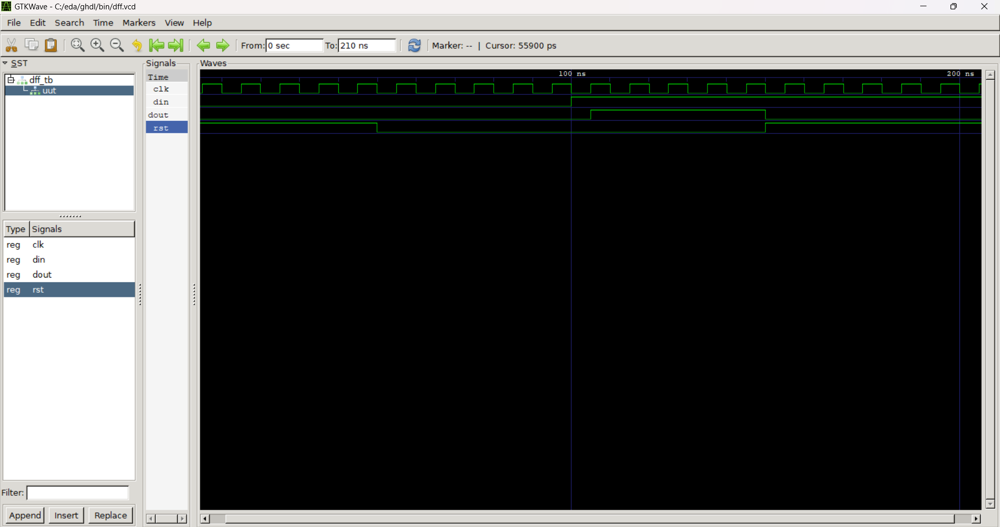
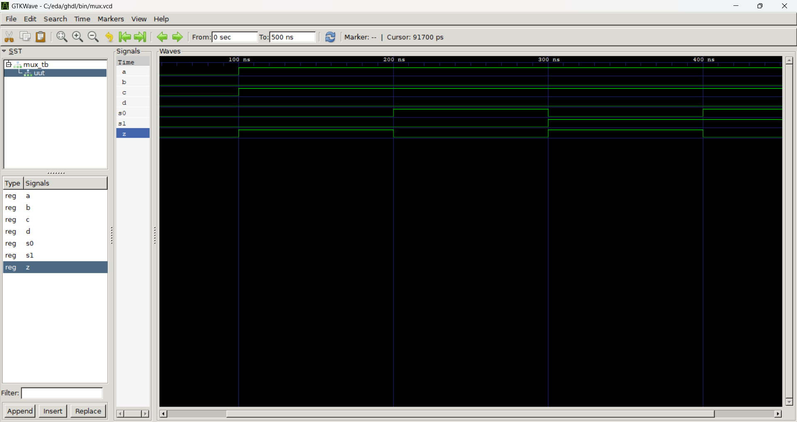

# Lab 1 - GHDL and GTKWave

**Procedure**
- Study VHDL & GHDL
- Install GHDL and GTKWave
- Run the hello World example
- Run the Half Adder example
- Run the D Flip-Flop example
- Run the 4-to-1 Multiplexer

**Results**
## Hello World

### Half Adder

### D Flip Flop

## 4-to-1 Multiplexer

**Things learned**
- What VHDL & GHDL are, their purpose, and differences between them
- Adding binary numbers
- How Half Adders and Full Adders work
- How different types of flip-flops work (such as SR, D, T)
- How multiplexers work

> This lab followed the steps from the [GHDL](https://github.com/kevinwlu/dsd/tree/master/ghdl#getting-started-with-vhdl-on-linux-ghdl--gtkwave-by-nerdy-dave) folder from the [Digital System Design (DSD)](https://github.com/kevinwlu/dsd/tree/master) repository