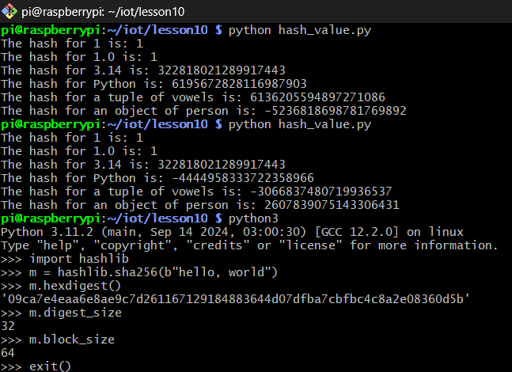
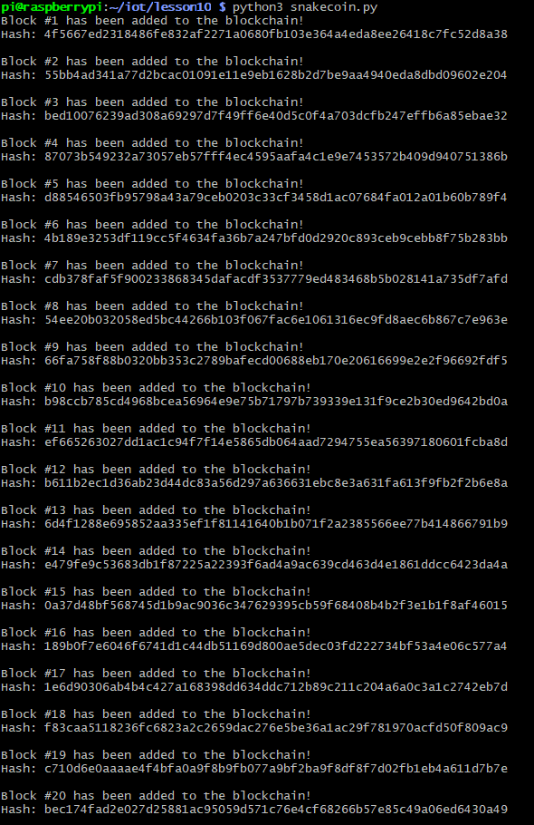
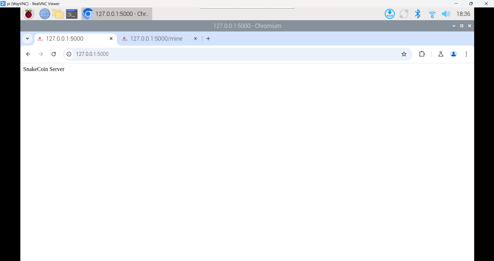
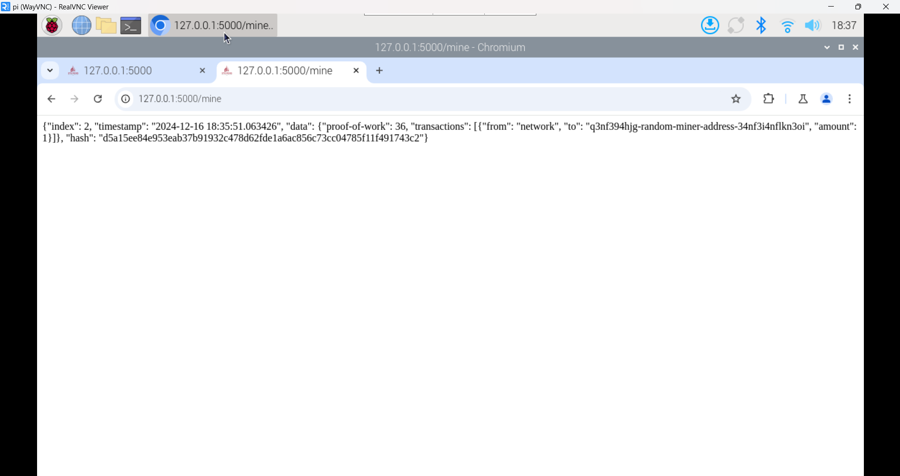
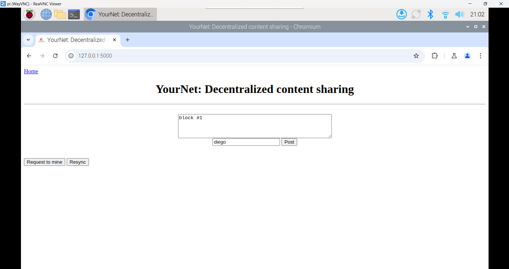
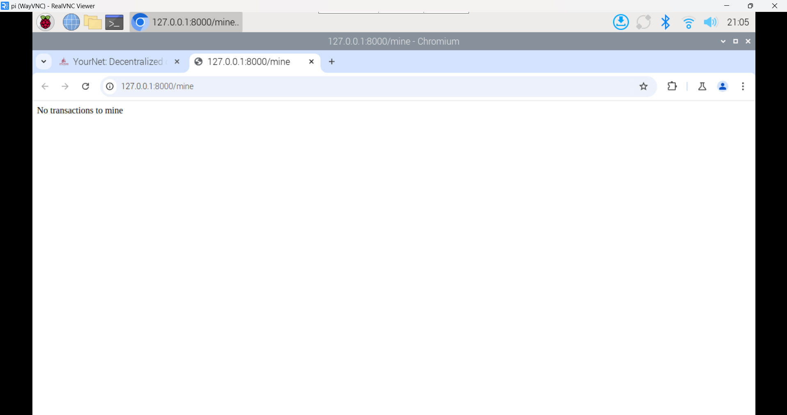

# Lab 10 - Blockchain

## Procedure
* Study Lesson 10
* Run hash_value.py twice and compare results
* Run snakecoin.py
* Run snakecoin-server-full-code.py on Terminal 1 and mine a new block on Terminal 2
* Clone Python blockchain app and uncomment the last line of node_server.py
* Run node_server.py on Terminal 1 and run_app.py on Terminal 2

## Results
**Hash function**

**SnakeCoin**

**SnakeCoin Severs 1-2**

**Blockchain app**

## Things learned
* Understanding digital or cryptocurrency concepts
* Learning how blockchains work as a decentralized ledger
* Exploring cryptographic hash functions and their role in securing data
* Understanding how mining validates transactions and adds blocks to the blockchain

> This lab followed the steps from [Lesson 10](https://github.com/kevinwlu/iot/tree/master/lesson10) folder from the [IoT](https://github.com/kevinwlu/iot) repository
