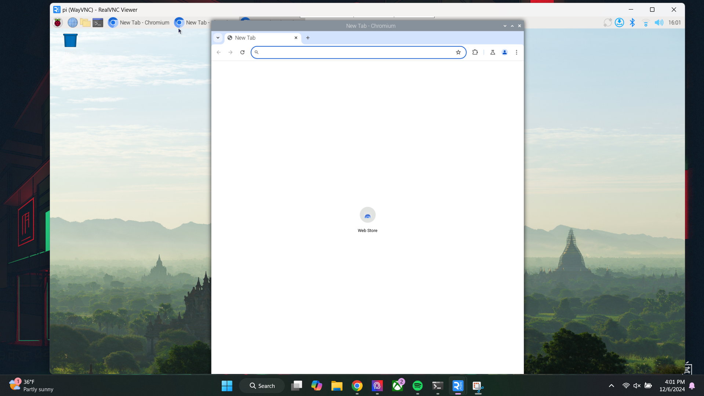
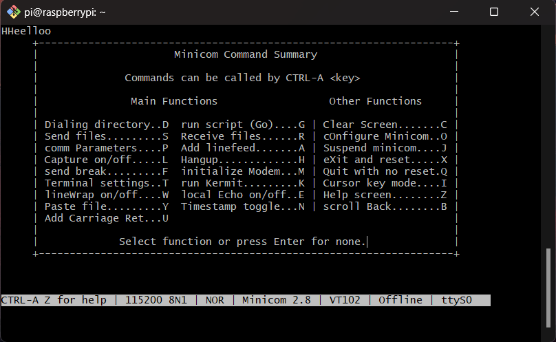
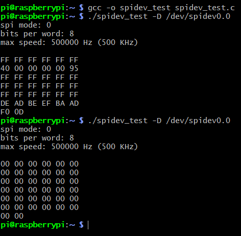
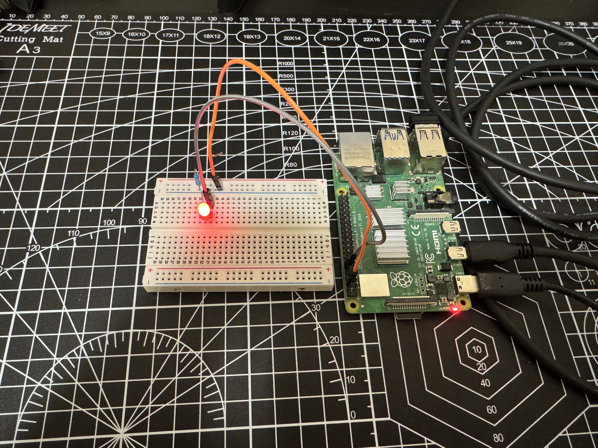

# Lab 2 - IoT

## Procedure
* Study Lessons 1 & 2
* Follow the steps to complete the labs

## Results
**1D: SSH and VNC**

**2A: Serial loopback test**

**2B: Serial peripheral interface (SPI)**

**2D: Light-emitting diode(LED)**

## Things learned
* Understanding of VNC and SSH protocols for remote system
* Raspberry Pi communication protocols, including SPI
* GPIO pin configuration, including setting pins as input or output and controlling their state

> This lab followed the steps from [Lesson 1](https://github.com/kevinwlu/iot/tree/master/lesson1) and [Lesson 2](https://github.com/kevinwlu/iot/tree/master/lesson2) folders from the [IoT](https://github.com/kevinwlu/iot) repository