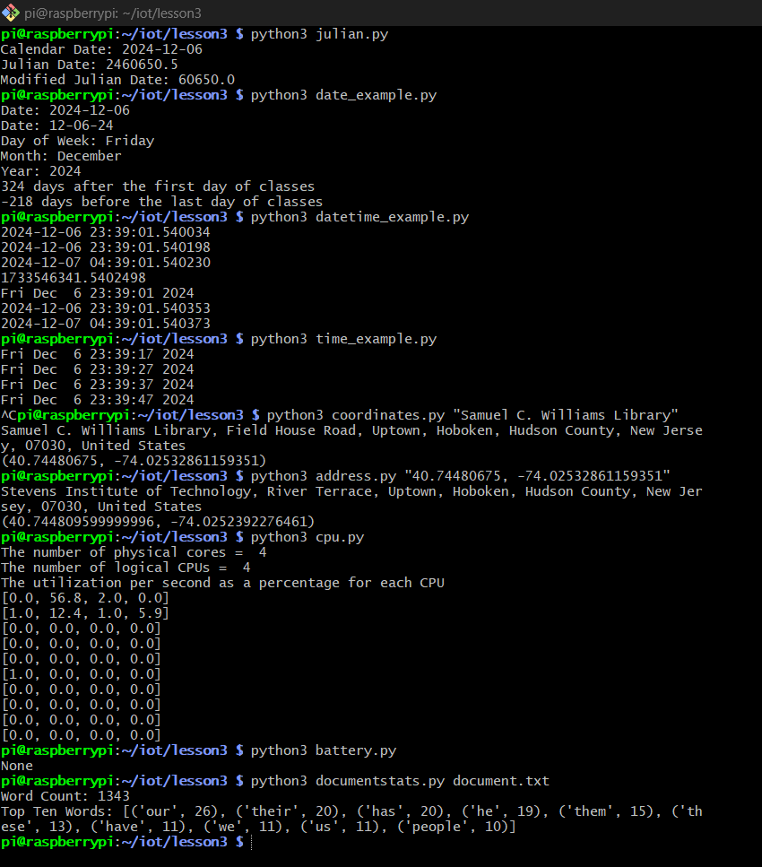

# Lab 3 - Python

## Procedure
* Study Lesson 3
* Install required Python packages such as jdcal, astral, and geopy

## Results

## Things learned
* Understanding how packages work and how to use them effectively
* Using commands to execute Python scripts in various environments
* Learning and applying essential Python commands

> This lab followed the steps from [Lesson 3](https://github.com/kevinwlu/iot/tree/master/lesson3) folder from the [IoT](https://github.com/kevinwlu/iot) repository