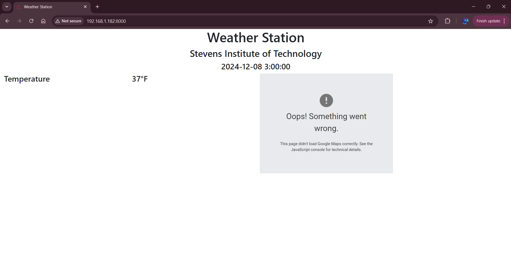
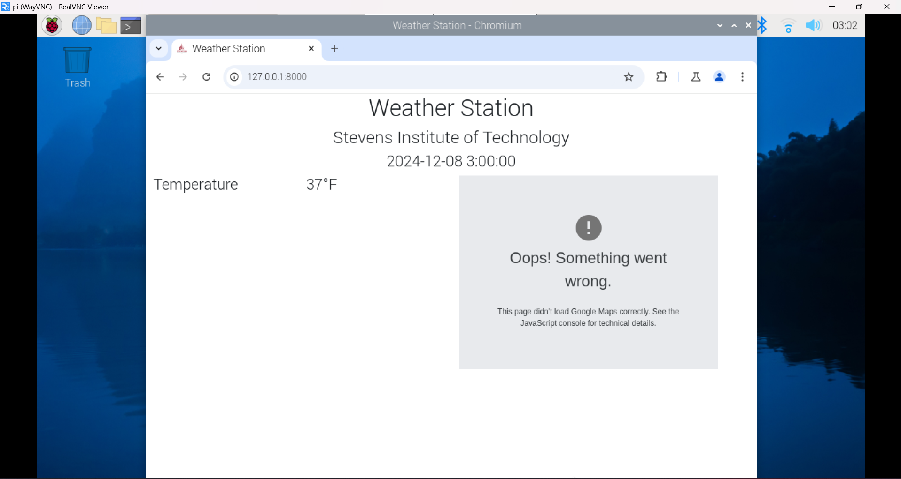
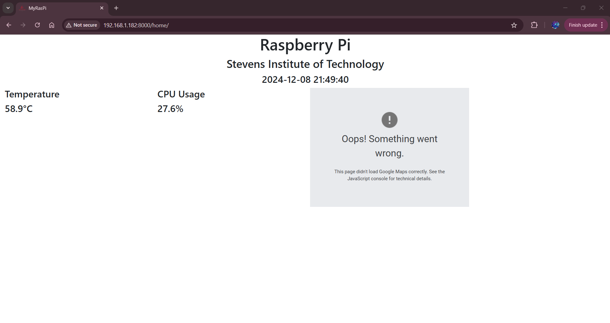
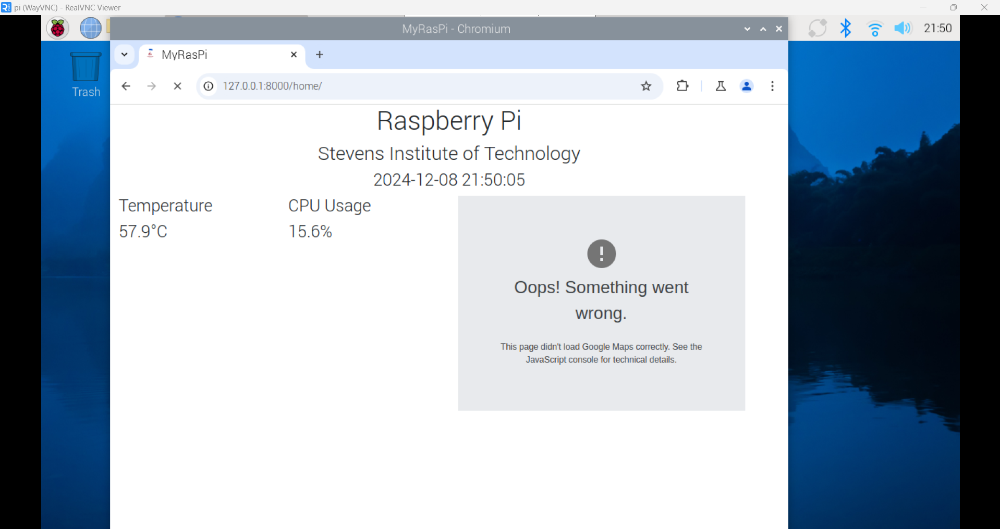
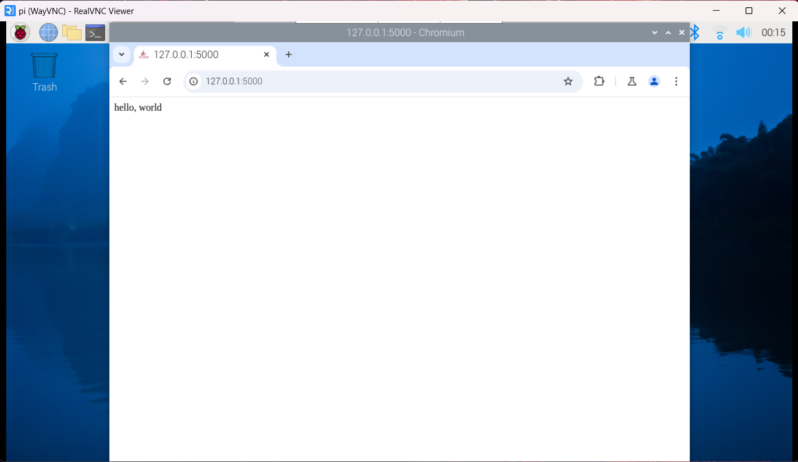

# Lab 4 - Django and Flask

## Procedure
* Study Lessons 4
* Install Django and Django REST framework
* Use the default database, i.e., SQLite
* Start Django project "stevens," run server, and view app 
* Start Django REST project "mycpu," run server, and view app
* Install Flask if no module named 'flask'
* Run Flask server via hello_world.py and view app

## Results
**Django project [stevens](https://github.com/kevinwlu/iot/tree/master/lesson4/stevens)**

**Django REST project [mycpu](https://github.com/kevinwlu/iot/tree/master/lesson4/myraspi)**

**4C: Flask**

## Things learned
* Created and connected MySQL databases.
* Gained understanding of how APIs work.
* Ran Django servers locally and on remote hosts.
* Learned how Flask servers function and are deployed.

> This lab followed the steps from [Lesson 4](https://github.com/kevinwlu/iot/tree/master/lesson4) folder from the [IoT](https://github.com/kevinwlu/iot) repository