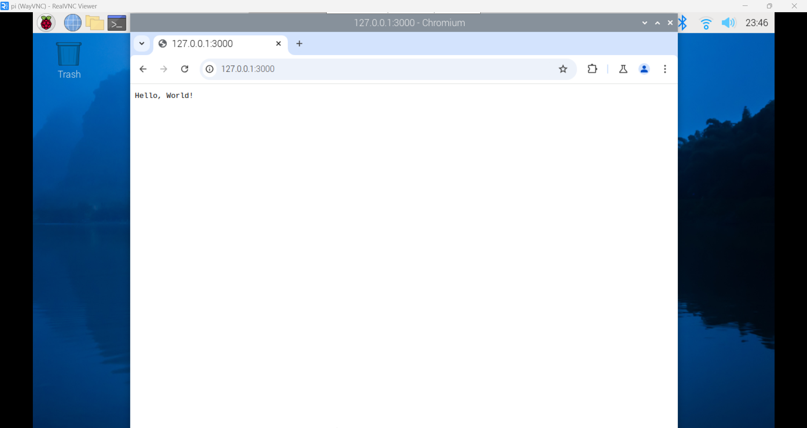
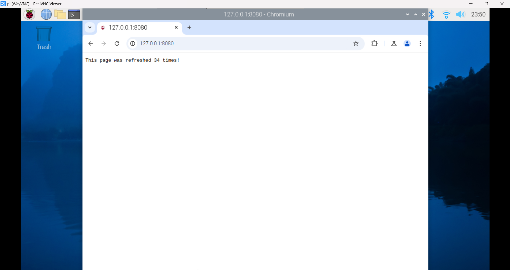
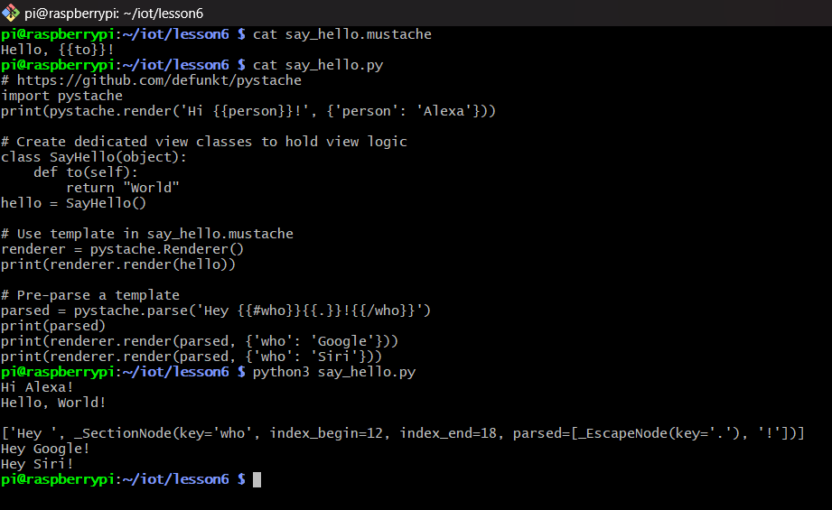

# Lab 6 - Node.js and Pystache

## Procedure
* Study Lesson 6
* Install Node.js and run hello-world.js, hello.js, and http.js
* Install Pystache and run say_hello.py that uses the template in say_hello.mustache

## Results
**Hello-world.js**

**Hello.js**

**http.js**

**6B: Pystache**

## Things learned
* Understanding of server-side JavaScript development with Node.js
* How to use Pystache for templating in Python applications

> This lab followed the steps from [Lesson 6](https://github.com/kevinwlu/iot/tree/master/lesson6) folder from the [IoT](https://github.com/kevinwlu/iot) repository

