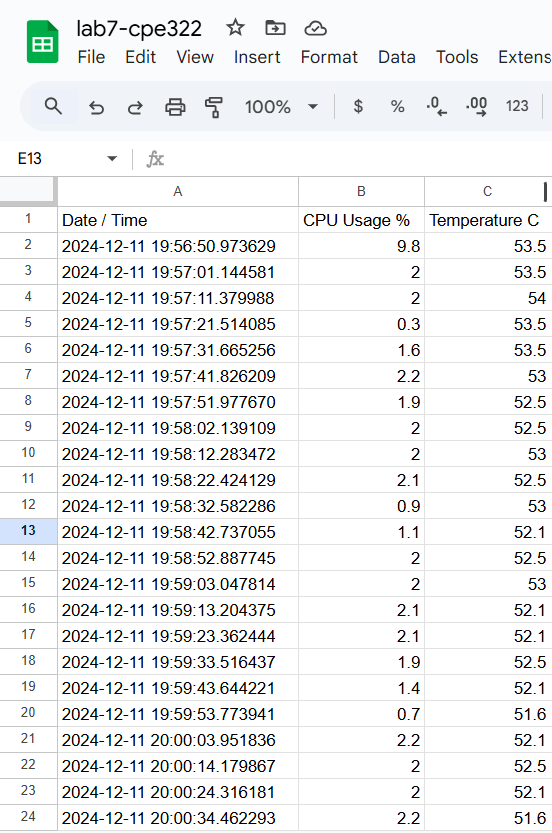

# Lab 7 - Cloud Platforms

## Procedure
* Study Lesson 7 
* Install gspread and oauth2client
* Log in the Google Cloud Platform Identity and Access Management, create a project cpudata, enable both Drive API and Sheets API, create and download service account JSON key file
* Start a new Google sheet cpudata, share it with the client email in the JSON file, delete Rows 2 to 1000, and edit the header cells
* Run cpu_spreadsheet.py with the JSON key file in a demo folder

## Results
**Google Sheets**

## Things learned
* Understanding of cloud infrastructure and operations
* How APIs enable communication between different services and systems
* Familiarized with Google Cloud Platform, including the use of keys
* JSON

> This lab followed the steps from the [Lesson 7](https://github.com/kevinwlu/iot/tree/master/lesson7) folder from the [IoT](https://github.com/kevinwlu/iot/tree/master) repository
