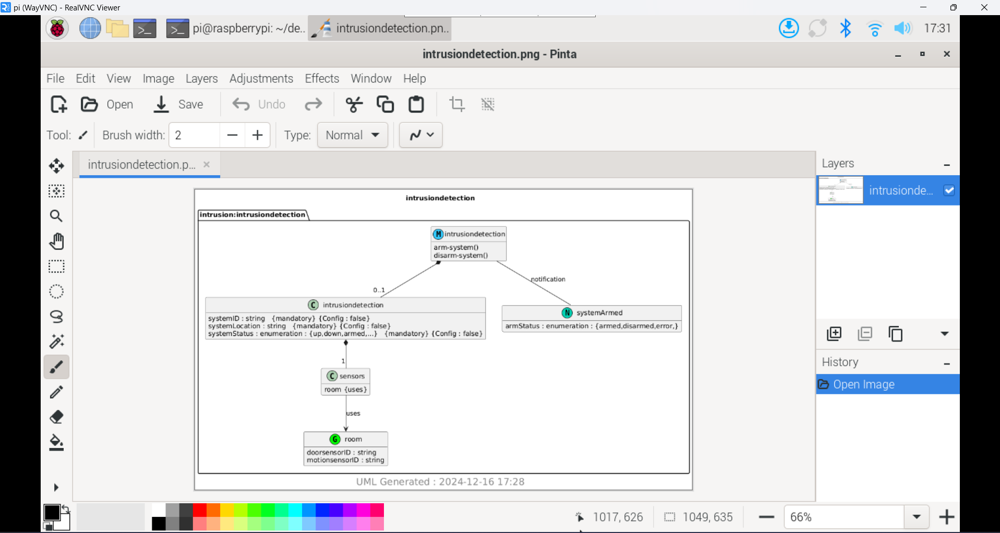
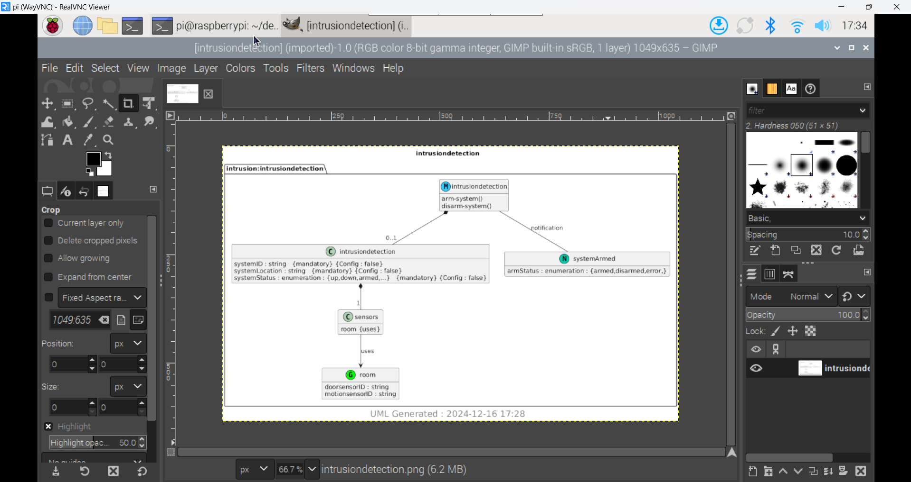

# Lab 9 - YANG

## Procedure
* Study Lesson 9
* Install pyang and PlantUML
* Run pyang to generate intrusiondetection.yin and intrusiondetection.uml
* Run PlantUML to generate intrusiondetection.png

## Results
**Pinta**

**GIMP**

## Things learned
* Learned how YANG modules define the structure and organization of network data
* Discovered how to convert YANG modules into XML-based YIN modules
* Explored how to open and view generated files using a VNC viewer

> This lab followed the steps from [Lesson 9](https://github.com/kevinwlu/iot/tree/master/lesson9) folder from the [IoT](https://github.com/kevinwlu/iot) repository
